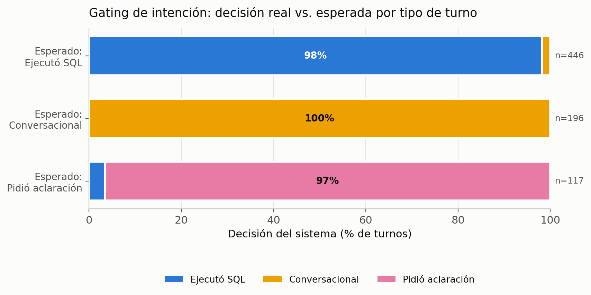
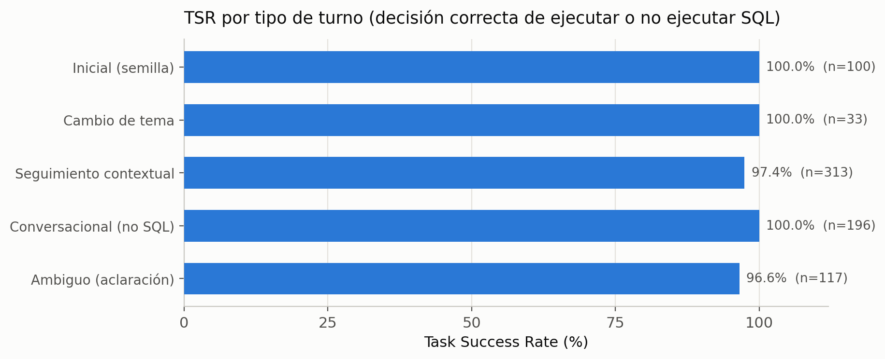
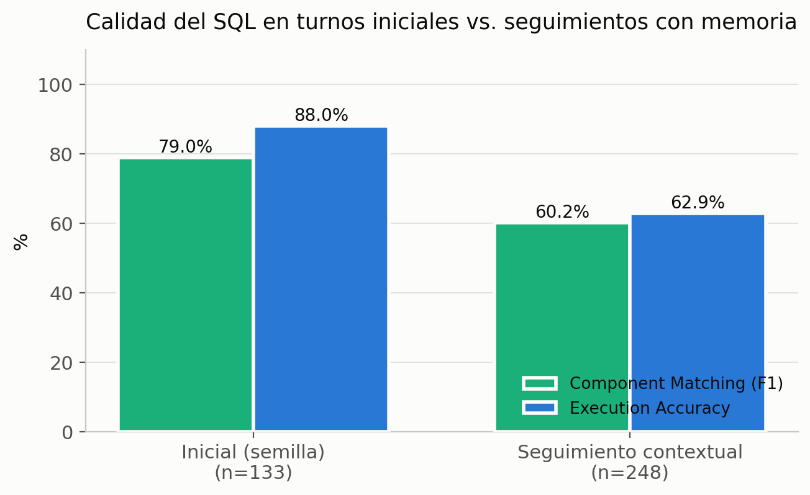

# Evaluación multiturno — RAG+Memoria+Intención+DIN+DEA

Corrida real sobre **100 conversaciones completas** (759 turnos evaluados) contra la BD de prueba, con memoria conversacional persistente. Métricas por conversación (DSR) calculadas solo sobre conversaciones completas; métricas por turno sobre todos los turnos con resultado.

## Métricas globales

- **Gating accuracy** (decisión exacta EXECUTE_SQL/NO_SQL/CLARIFY): **98,4 %**
- **Task Success Rate** (ejecutar SQL exactamente cuando corresponde): **98,4 %**
- **False-execute** (ejecutó SQL cuando no debía): 1,3 % (4/313)
- **False-abstain** (no ejecutó cuando debía): 1,8 % (8/446)
- **Execution Accuracy global** (turnos con SQL de oro): 71,7 %
  - En turnos iniciales: 88,0 % (n=133)
  - En seguimientos contextuales (requieren memoria): 62,9 % (n=248)
- **Correcto al primer intento** (sin autocorrección): 100,0 %
- **Dialogue Success Rate** (conversaciones con TODOS los turnos correctos): 51,0 %

