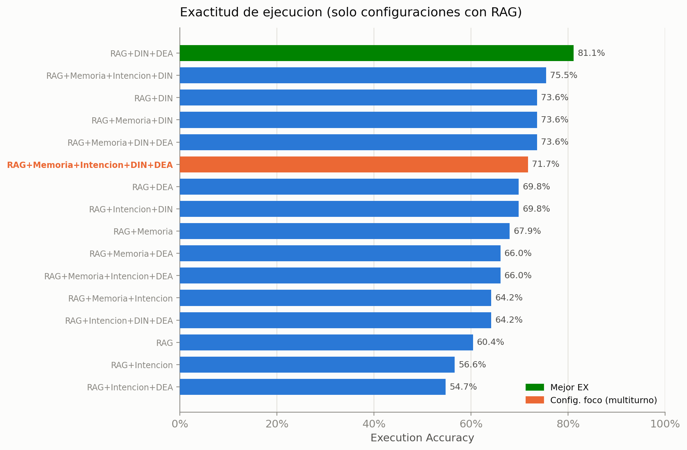
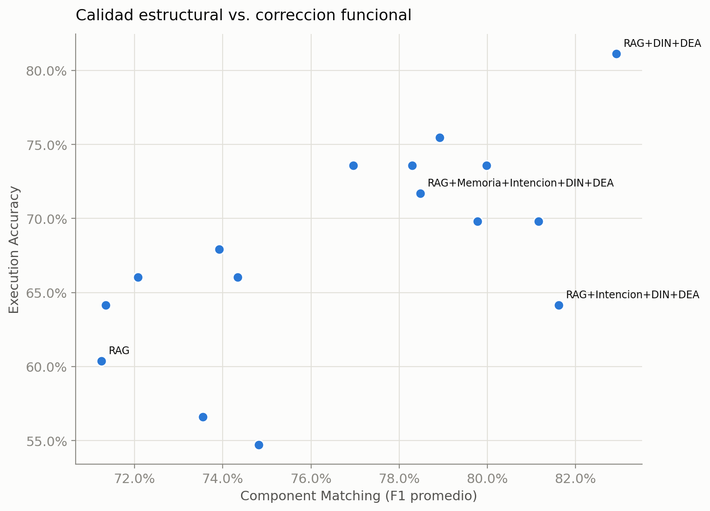
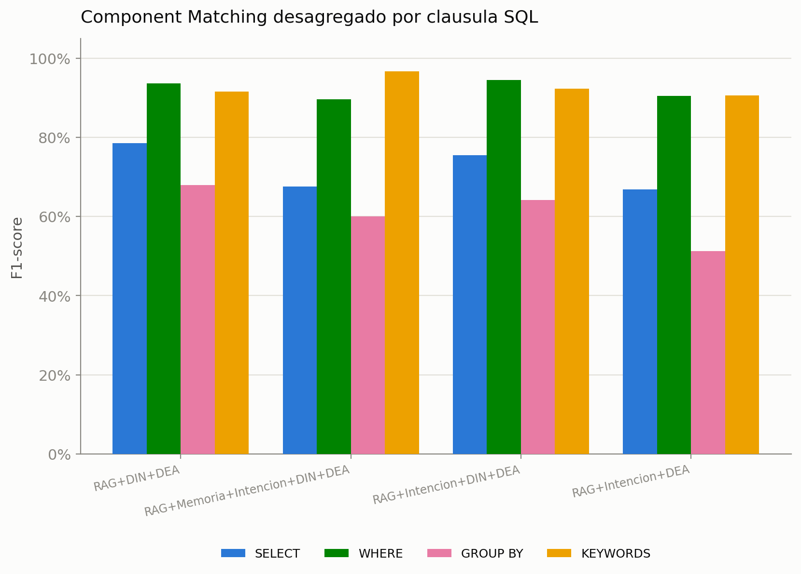
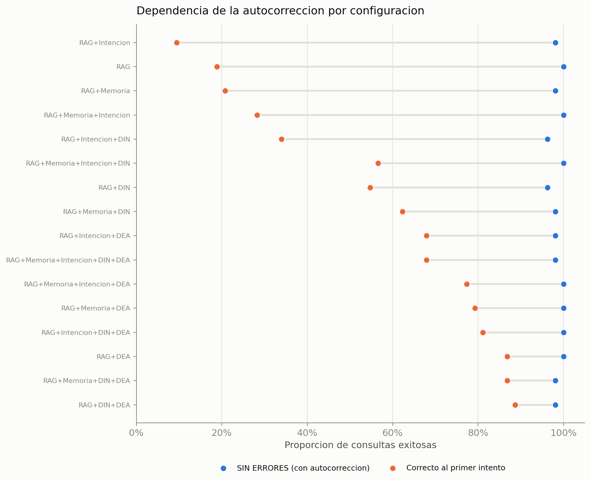
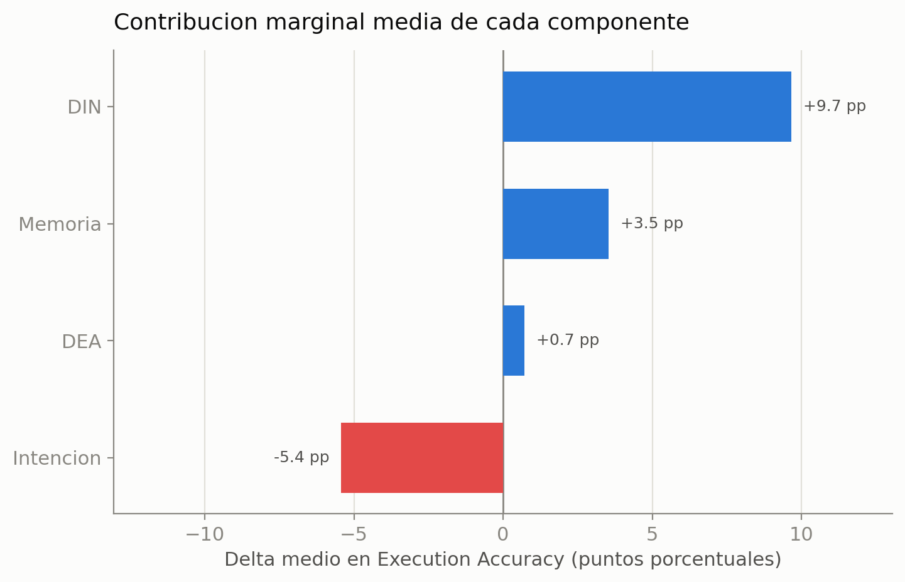
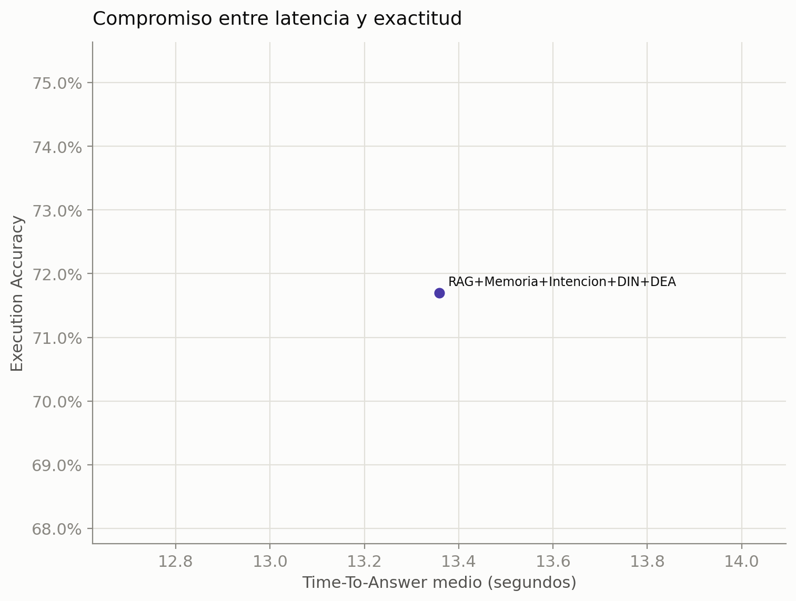

# Analisis de pruebas del sistema Text-to-SQL (estudio de ablacion)

> Generado automaticamente por `generar_analisis_ablacion.py` a partir de `dataset_sql_40_med_complex.xlsx` (hoja **Medianas_y_Complejas**, filas con `EVALUADO = 1`).

## 1. Alcance de los datos

- **Solo se consideran configuraciones que incluyen RAG.** Generar SQL sin recuperacion del contexto del esquema no tiene sentido en este dominio ERP: el modelo no puede resolver tablas ni columnas de forma fiable sin ese anclaje. Las combinaciones sin RAG se excluyen del analisis.
- Configuraciones con RAG efectivamente evaluadas: **16**.
- Total de ejecuciones calificadas: **848**.
- Cada configuracion se identifica por la combinacion de componentes activos `[Rag]`, `[Memoria]`, `[Intension]`, `[Din]`, `[Dea]`.
- Metricas por consulta: Component Matching (F1 de SELECT/WHERE/GROUP BY/KEYWORDS), Execution Accuracy (EX), SIN ERRORES (robustez con autocorreccion), correcto al primer intento (sin autocorreccion) y Time-To-Answer (TTA).

## 2. Tabla resumen por configuracion

Ordenada por Execution Accuracy descendente.

| # | Configuracion | n | CM (F1) | EX | SIN ERRORES | 1er intento | TTA (s) |
|---|---------------|---|---------|----|-------------|-------------|---------|
| 1 | RAG+DIN+DEA | 53 | 82.9% | 81.1% | 98.1% | 88.7% | n/d |
| 2 | RAG+Memoria+Intencion+DIN | 53 | 78.9% | 75.5% | 100.0% | 56.6% | n/d |
| 3 | RAG+Memoria+DIN+DEA | 53 | 77.0% | 73.6% | 98.1% | 86.8% | n/d |
| 4 | RAG+Memoria+DIN | 53 | 78.3% | 73.6% | 98.1% | 62.3% | n/d |
| 5 | RAG+DIN | 53 | 80.0% | 73.6% | 96.2% | 54.7% | n/d |
| 6 | RAG+Memoria+Intencion+DIN+DEA | 53 | 78.5% | 71.7% | 98.1% | 67.9% | 13.4 |
| 7 | RAG+Intencion+DIN | 53 | 79.8% | 69.8% | 96.2% | 34.0% | n/d |
| 8 | RAG+DEA | 53 | 81.2% | 69.8% | 100.0% | 86.8% | n/d |
| 9 | RAG+Memoria | 53 | 73.9% | 67.9% | 98.1% | 20.8% | n/d |
| 10 | RAG+Memoria+Intencion+DEA | 53 | 72.1% | 66.0% | 100.0% | 77.4% | n/d |
| 11 | RAG+Memoria+DEA | 53 | 74.3% | 66.0% | 100.0% | 79.2% | n/d |
| 12 | RAG+Intencion+DIN+DEA | 53 | 81.6% | 64.2% | 100.0% | 81.1% | n/d |
| 13 | RAG+Memoria+Intencion | 53 | 71.4% | 64.2% | 100.0% | 28.3% | n/d |
| 14 | RAG | 53 | 71.3% | 60.4% | 100.0% | 18.9% | n/d |
| 15 | RAG+Intencion | 53 | 73.6% | 56.6% | 98.1% | 9.4% | n/d |
| 16 | RAG+Intencion+DEA | 53 | 74.8% | 54.7% | 98.1% | 67.9% | n/d |

## 3. Exactitud de ejecucion

La mejor configuracion en exactitud de un solo turno es **RAG+DIN+DEA** con **81.1%** de Execution Accuracy. Sin embargo, el analisis posterior se centra en la configuracion completa por razones de aplicabilidad real (ver seccion siguiente).

## 4. Configuracion foco: RAG+Memoria+Intencion+DIN+DEA

Aunque en exactitud de un solo turno esta configuracion (**71.7%** de EX) no es la mejor, es la unica que integra los dos componentes imprescindibles para el uso real del sistema:
- **Memoria**: preserva el contexto conversacional, condicion necesaria para resolver preguntas de seguimiento (p. ej. *"dime a que tipo pertenece"* refiriendose a una entidad mencionada en un turno anterior).
- **Intencion**: decide *cuando* debe ejecutarse SQL y cuando no, evitando que mensajes conversacionales, ambiguos o fuera de dominio disparen consultas innecesarias contra la base de datos.

Su perfil de metricas es: CM 78.5%, EX 71.7%, SIN ERRORES 98.1%, correcto al primer intento 67.9%. En exactitud y generacion directa cede algunos puntos frente a RAG+DIN+DEA: es el costo de anadir los componentes conversacionales; su justificacion no esta en el turno aislado sino en el escenario multiturno.

> Por esta razon, la evaluacion multiturno del sistema (dataset `preguntas_multiturno.csv`) se disena a partir de las preguntas de esta configuracion: el objetivo es medir si el sistema (i) detecta correctamente cuando ejecutar SQL y cuando no, y (ii) cuando lo ejecuta, construye la consulta usando el contexto acumulado de la conversacion.

## 5. Calidad estructural vs. correccion funcional

Incluso entre configuraciones con RAG, un Component Matching similar produce Execution Accuracy muy distintas: la correspondencia estructural es condicion necesaria pero no suficiente para generar SQL ejecutable. El caso mas ilustrativo es **RAG+Intencion+DIN+DEA**, con CM elevado (~81,6\%) pero una EX de solo 64,2\%: anadir la clasificacion de Intencion sobre RAG+DIN+DEA introduce un sesgo que degrada la ejecucion pese a mantener la calidad estructural.

Al desagregar el Component Matching, SELECT, WHERE y KEYWORDS concentran los valores mas altos, mientras **GROUP BY** es sistematicamente inferior: las operaciones de agregacion suelen quedar implicitas en el lenguaje natural y exigen mayor inferencia semantica.

## 6. Robustez y dependencia de la autocorreccion

La distancia entre *SIN ERRORES* (con autocorreccion) y *correcto al primer intento* mide cuanto depende cada configuracion de los ciclos de reparacion. Configuraciones minimas como **RAG** o **RAG+Intencion** muestran una brecha amplia: terminan siendo funcionales, pero a costa de multiples iteraciones de correccion. En cambio, **RAG+DIN+DEA** y la configuracion foco **RAG+Memoria+Intencion+DIN+DEA** exhiben una brecha estrecha, es decir, generan SQL correcto desde el primer intento — propiedad clave para un flujo conversacional fluido.

## 7. Contribucion marginal de cada componente (dentro de RAG)

Como todas las configuraciones analizadas ya incluyen RAG, este grafico aisla el aporte marginal de los componentes *adicionales* sobre esa base. **DIN** es el que mas aporta a la exactitud de ejecucion (~+9,5 pp), seguido de **Memoria** (~+3,4 pp) y **DEA** (~+0,6 pp). La clasificacion de **Intencion** presenta un aporte marginal *medio* negativo (~-5,6 pp) sobre la exactitud: su valor no esta en mejorar la generacion de SQL, sino en **filtrar cuando debe o no ejecutarse una consulta**, un beneficio que no se refleja en la Execution Accuracy de un solo turno pero que es esencial en el escenario multiturno.

## 8. Compromiso latencia / exactitud

El TTA permite valorar el costo operativo de cada ganancia de exactitud, aspecto critico en un entorno ERP donde la latencia condiciona la experiencia de usuario.

## 9. Sintesis

1. RAG es un requisito de base: sin recuperacion del esquema la generacion de SQL no es viable, por lo que el analisis se restringe a configuraciones con RAG.
2. Un alto Component Matching no garantiza SQL ejecutable: hay que medir explicitamente la ejecucion.
3. **RAG+DIN+DEA** maximiza la exactitud de un solo turno; **DIN** es el componente adicional de mayor aporte marginal.
4. La configuracion foco **RAG+Memoria+Intencion+DIN+DEA** se selecciona para el despliegue real porque anade Memoria e Intencion — los componentes que habilitan el dialogo multiturno y la deteccion de cuando ejecutar SQL —, aceptando una perdida moderada de exactitud y de generacion directa frente a RAG+DIN+DEA; la evaluacion multiturno (759 turnos reales) confirma que esa perdida compra gating de intencion del 98,4% y resolucion de contexto del 97,4%.
5. La evaluacion multiturno (dataset `preguntas_multiturno.csv`) mide justamente esas dos capacidades que la Execution Accuracy de un solo turno no captura.
